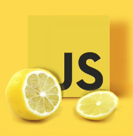

# JavaScript Essential

## Hands on training

### Materi Cover

#### Intro.

1. Pengantar.
2. Apa itu JavaScript.
3. Bagaiaman JavaScript bekerja.
4. JavaScript Console.
5. Object dalam JavaScript.
6. JavaScript Syntax
    
#### Basic Syntax.

7. Primitive Data.
8. Variable, Constant & Assigment.
9. Arithmetic Operator & BODMAS (Bracket pOwers() )
10. Assignment Operator.
11. Code Editor & Debugging.
12. Function or Subroutine.
13. Object & Array
14. Embedding Object & Array.
15. Member Access.
16. Computed Member Access.
17. Member Creation, Assignment & Deletion.
18. Array Modification.
19. Callable Object.
20. Memory Hoisting.
21. Scope & Closures.
22. Inferred Global & Scope.
23. This Context.
24. Constructor.
25. Prototype.
26. Constructor with Prototype.

#### Comparison & Conditional Execution.

27. Comparison Operator.
28. If Statement.
29. For & For In Loop.
30. Let ES6.

#### DOM Manipulation.

31. Understanding the Document Object Model.
32. Targeting DOM Element.
33. Changing Element Content.
34. Changing Element Style.
35. Event Handlers.
36. Create & appendChild & insertBefore method.
37. Project.

 

### Hello world

	// console.log("Hello, world!!")

	// document.getElementById('heading').innerHTML = "Hello, world!"

### Variable 

	//var name = "Dyo";
	//console.log(name);
	//
	//var lastName = "Bumi";
	//console.log(lastName);
	//
	//var age = 26;
	//console.log(age);
	//
	//var fullName = name + ' ' + lastName;
	//console.log(fullName);
	//
	//var fullName = true;
	//console.log(fullName);
	//
	//var job = "Trainer";
	//console.log(job);
	//
	//var bio = "Nama saya " + name + " " + lastName + " Umur saya " + age + " " + "Pekerjaan saya adalah " + job;
	//
	//console.log(bio);

### Operator

	//var x = 5;
	//var y = 7;
	//var z = x + y;
	//console.log(z);
	//
	//var x = 5;
	//var y = 2;
	//var z = x * y;
	//console.log(z);

### macam operator aritmetik

	//+ 
	//-
	///
	//%
	//++ --> increment
	//-- --> decrement

	// assigmment operator

	//Operator  Contoh 				Sama seperti
	//=					x = y					x = y
	//+= 				x += y				x = x + y
	//-= 				x -= y				x = x - y
	//*=				x *= y				x = x * y
	///= 				x /= y 				x = x / y
	//%=				X %= y				x = x % y

	//var x = 10;
	//x += 5;
	//console.log(x);

	// String Operator

	//text1 = "Dyo";
	//text2 = "Bumi";
	//text3 = text1 + " " + text2;
	//console.log(text3);

	//x = 5 + 5;
	//y = "5" + 5;
	//z = "Hello" + 5;
	//console.log(x); 
	//console.log(y);
	//console.log(z);

### Comparison Operator

	//==		equal to (value)
	//===		equal value and equal type
	//!= 		not equal
	//!== 	not equal value atau not equal type
	//> 		greather than 
	//< 		less than 
	//>= 		greather than atau equal to 
	//<= 		less than atau equal
	//? 		ternary operator

### Logical Operator

	//&&		logical and
	//|| 		logical or
	//!			logical not

### Type Operator

	//typeof				return--> tipe 
	//instanceof 		return--> bolean
	//
	//// Bitwise
	//
	//& | ~ ^ << >> >>>

### If Else Statement

	//var name = "Brandon";
	//var age = 16;
	//var isYoung = "Yes";
	//
	//if (isYoung == 'No') {
	//	console.log(name + " is young man")
	//} else {
	//	console.log("I hope he mature soon")
	//}
	//
	//var hour = 18; 
	//if (hour < 18) {
	//	console.log('say yes!')
	//} else {
	//	console.log('say nop !!')
	//}
	//
	//var time = 20;
	//if (time < 10) {
	//	console.log("Say no way!!")	
	//} else if (time < 20) {
	//	console.log("say maybe yes")
	//} else {
	//	console.log("Good on you!")
	//}

### TYPE DATA

#### TYPE DATA PRIMITIF (not object)

	// * Number: float, decimal, integer.
	// * String: Charackter, text.
	// * Boolean: Logical 2 nilai saja true dan false.
	// * Undefined: Variable belum memiliki nilai.
	// * Null: non-existent, memiliki nilai, yakni null.

#### BOOLEAN

	// Yes or No
	// On or Off
	// True or False

	// Boolean(10 > 9)

	//console.log(Boolean(10 > 9));
	//console.log(Boolean(10 > 19));

### Comparison dan Condition

	// == equal 				---> if (day == 'Senin')
	// >  greater than	---> if (gaji > 1.000.000)
	// <	less than	 		---> if (age < 18)

	// Everything With a "Value" is True

	//console.log(Boolean(100));
	//console.log(Boolean(3.14));
	//console.log(Boolean(-15));
	//console.log(Boolean("Hello"));
	//console.log(Boolean("false"));

	//console.log(Boolean(false));
	//console.log(Boolean(true));

	// Everything Without a "Value" is False

	//var x = 0;
	//console.log(Boolean(x));
	//console.log(Boolean(x));

	//var y = "";
	//console.log(Boolean(y));

	//var z = "NaN";
	//console.log(Boolean(z));

	// Tools Debugging JS

	// * console.log()
	// * alert()
	// * prompt()

	//var z = "NaN";
	//alert(Boolean(z));

	//var name = prompt("What is your name");
	//alert(name);

### Switch Condition

	//var job = 'Trainer';
	//
	//job = prompt("Apa profesi si Dyo?")
	//		
	//switch (job) {
	//	case 'Trainer':
	//		console.log('Dyo adalah betul seorang Trainer');
	//		break;
	//	case 'Driver':
	//		console.log('Dyo bukan seorang Driver');
	//		break;
	//	case 'Polisi':
	//		console.log('Polisi itu mengejar penjahit');
	//		break;
	//	default:
	//		console.log('Dyo bukan Driver dan Polisi dan apapun itu');
	//}

### JavaScript Function

* Function adalah Aspek yang penting dalam JavaScript dan bahasa programming yang lain.

* Block of code, untuk menjalankan task khusus dalam programming.

* Function akan tereksekusi apabila dipanggil (call).

* Function di buat untuk mengurangi penulisan code secara berulang-ulang, mengembalikan return.

> DRY = Do not Repeat Your self;

#### contoh penulisan function

	//function xxx(argument) {
	//	...
	//}
	//xxx();

	//function yo() {
	//	console.log('Yo !!!')
	//}
	//yo();

	//function yo(name) {
	//	console.log(name)
	//}
	//yo("Dyo!!");

	//var name = "Brandon"
	//function yo() {
	//	console.log(name)
	//}
	//yo(name);

	//function yo(name, age) {
	//	console.log(name + ' ' + age)
	//}
	//yo("Dyo!!", 35);
	//yo("Brandon", 16);
	//yo("Ersya", 20);

	//function tambah(satu, dua) {
	//	return satu + dua; 
	//}
	//console.log(tambah(5, 10));

	// function dengan condition if

	//function yo(name, age) {
	//	if (age > 35) {
	//		return name + ', not that old!';
	//	} else {
	//		return name + ', is still young'
	//	}
	//}
	//var nama = yo('Dyo', 30);
	//console.log(nama);
	//console.log(yo('Dyo', 30));

	//function coba(a, b) {
	//	return a + b;
	//}
	//var cobi = coba("Dyo", " is Cool!");
	//console.log(cobi);
	//document.getElementById("element1").innerHTML = cobi;
	//alert(cobi);

### Statement dan Expression di dalam JavaScript

#### statement

	//function myFunc() {
	//	// code
	//}
	//
	///* statement */
	//if (x === 5) {
	//	// do something here
	//}
	//
	///* expression */
	//3 + 4;
	//var x = 3;

### JavaScript Arrays

	//var name = 'Joni';
	//var lastName = 'Gudel';
	//
	//var names = ['Joni', 'Gudel', 1990, 'Instruktur'];

	/* cara akses array */
	//console.log(names);
	//console.log(names[0]);
	//console.log(names[3]);

	/* mutation */
	//names[1] = 'Doer';
	//console.log(names);

	/* push */
	//names.push('Merah');
	//console.log(names[4]);

	/* unshift */
	//names.unshift('Bapak');
	//console.log(names);

	/* pop */
	//names.pop();

	/* shift */
	//names.shift();

### JavaScript Object

	//var car = {
	//	color: 'blue',
	//	year: 2010,
	//	drive: function(){return 'drive'}
	//};

	//var shopList = [
	//	'Apple',
	//	'Orange',
	//	'Pear'
	//]

### Menyisipkan Array dan Object

	//var car = {
	//	made: "Honda",
	//	speed: 160,
	//	engine: {
	//		size: 2.5,
	//		made: 'Daihatsu',
	//		fuel: 'Pertamax',
	//		piston: [
	//			'2010',
	//			{make: 'China'},
	//			{make: 'Japan'}
	//		], 
	//	},
	//	drive: function(){ return 'drive';}
	//};
	//
	//var array = [
	//	'string',
	//	1000,
	//	[true, 100],
	//	{name: 'Joh'},
	//	function() { return 'drive'; }
	//];

> **Tugas!** Membuat satu buah array, bisa apa saja, yg memuat 
type data string, number, boolean, array juga, 
object, dan function. Buat array yang selogika mungkin yang ada pada kehidupan kita sehari-hari.

### Mengakses Array dan Object

	//var car = {
	//	made: "Honda",
	//	speed: 160,
	//	engine: {
	//		size: 2.5,
	//		made: 'Daihatsu',
	//		fuel: 'Pertamax',
	//		piston: [
	//			'2010',
	//			{make: 'China'},
	//			{make: 'Japan'}
	//		], 
	//	},
	//	drive: function(){ return 'drive';}
	//};
	//
	//var array = [
	//	'string',
	//	1000,
	//	[true, 100],
	//	{name: 'Joh'},
	//	function() { return 'drive'; }
	//];

	//console.log(car);
	//console.log(car.made);
	//console.log(car.engine);
	
> **Tugas 2** Dari object dan Array yang telah anda buat, 
buatlah sintax cara mengaksesnya.
Baik dengan cara tradisional atau dengan menggunakan square bracket [] seperti yang saya contohkan diatas. Silahkan upload jawaban anda di trello.

### Create, Asign & Delete Member Array dan Object

	var array = [
		'string',
		1000,
		[true, 100],
		{name: 'Joh'},
		function() { return 'drive'; }
	];

	//array
	//(5) ["string", 1000, Array(2), {…}, ƒ]
	//array[0]
	//"string"
	//array[1]
	//1000
	//array[0] = 'strong'
	//"strong"
	//array
	//(5) ["strong", 1000, Array(2), {…}, ƒ]
	//array[1] = 'seribu'
	//"seribu"
	//array
	//(5) ["strong", "seribu", Array(2), {…}, ƒ]

	//array
	//(5) ["string", 1000, Array(2), {…}, ƒ]0: "string"1: 10002: (2) [true, 100]3: {name: "Joh"}4: ƒ ()length: 5__proto__: Array(0)
	//array[6] = true
	//true
	//array
	//(7) ["string", 1000, Array(2), {…}, ƒ, empty, true]0: "string"1: 10002: (2) [true, 100]3: {name: "Joh"}4: ƒ ()6: truelength: 7__proto__: Array(0)
	//array[10] = 'member baru'
	//"member baru"
	//array
	//(11) ["string", 1000, Array(2), {…}, ƒ, empty, true, empty × 3, "member baru"]0: "string"1: 10002: (2) [true, 100]3: {name: "Joh"}4: ƒ ()6: true10: "member baru"length: 11__proto__: Array(0)
	//array['coba'] = 'coba1'
	//"coba1"
	//array['coba2'] = 'coba2'
	//"coba2"
	//array
	//(11) ["string", 1000, Array(2), {…}, ƒ, empty, true, empty × 3, "member baru", coba: "coba1", coba2: "coba2"]0: "string"1: 10002: (2) [true, 100]3: {name: "Joh"}4: ƒ ()6: true10: "member baru"coba: "coba1"coba2: "coba2"length: 11__proto__: Array(0)
	//array
	//(11) ["string", 1000, Array(2), {…}, ƒ, empty, true, empty × 3, "member baru", coba: "coba1", coba2: "coba2"]

### Prebuilt method

	// ** shift --> menghapus element pertama pada array
	//array
	//(5) ["string", 1000, Array(2), {…}, ƒ]
	//array.shift()
	//"string"
	//array
	//(4) [1000, Array(2), {…}, ƒ]

	// ** pop --> untuk menghapus element terakhir pada array
	//array
	//(5) ["string", 1000, Array(2), {…}, ƒ]0: "string"1: 10002: (2) [true, 100]3: {name: "Joh"}4: ƒ ()length: 5__proto__: Array(0)
	//array.pop()
	//ƒ () { return 'drive'; }
	//array
	//(4) ["string", 1000, Array(2), {…}]

	// ** unshift --> menambahkan element pertama pada array
	//array
	//(5) ["string", 1000, Array(2), {…}, ƒ]
	//array.unshift('function', 'tambah baru')
	//7
	//array
	//(7) ["function", "tambah baru", "string", 1000, Array(2), {…}, ƒ]

	// ** push --> menambahkan element pada urutan akhir array
	//array.push('car', 70)

	// ** splice() menambahkan, mengurangi **

	// 1 menghapus element
	//array.splice(2,2);
	//2 --> menghapus element mulai dari index ke 2
	//2 --> jumlah element yang akan dihapus start dari index ke 2

	// 2 menambah element diantara element yang ada
	// array.splice(1, 0, 'Hello', 'world', 2018)
	//1 --> menambah element mulai dari index ke 1.
	//0 --> jumlah element yang akan dihapus.
	//'Hello', 'world', 2018 --> element yang ditambahkan  

	// 3 Merubah dan Menghapus Element Array

	//array = [
	//	'Selamat',
	//	'pagi',
	//	900,
	//	true,
	//	12.5
	//]
	//
	//array.splice(2, 2, 2018, 'Dyo');

### JS Loops

loop adalah pengulangan (iteration)

loop sangat penting dalam sebuah programming karena menghemat waktu dan tenaga, ketimbang menulis program berulang-ulang untuk sebuah task tertentu, lebih baik membuat kode instruksi pengulangan (metode loop), sehingga program akan melakukan tugas berulang-ulang hingga syarat yang diinginkan seorang programmer terpenuhi.

contoh: kita ingin menuliskan number dari 0 hingga 10, dibandingkan kita menulis manual:

	//1
	//2
	//3
	//..

#### kita gunakan for loop:

	for (){
	
	}

sebagai pengganti menggunakan 1,2,3 kita gunakan i sebagai variable, maka kita tuliskan 

	for (var i){

	}

kita ingin mencetak pengulangan mulai dari 0, maka:

	//for (var i=0; ){
	//
	//}

kita ingin mencetak pengulangan dari 0 hingga 10, maka:

	//for (var i=0; i < 11; ){
	//
	//}

jika i lebih kecil dari 11, maka terus tambahkan secara otomatis i tersebut hingga i < 11, yakni 10:

	//for (var i=0; i < 11; i++ ){ 
	//
	//}

--> prinsip Start, Kondisi, Aksi tambah/kurang

tampilkanlah hasilnya di console:

	//for (var i=0; i < 11; i++ ){
	//  console.log(i);
	//}

keterangan hasilnya

	//i=0 --> start dari 0
	//i=1 --> i<11 --> i++ 
	//i=2 --> i<11 --> i++ dst

	//var i;
	//for (i=0; i < 11; i++){
	//	console.log(i)
	//}

	//var family = [
	//	'Ayah',
	//	'Ibu',
	//	'Kakak',
	//	'Adik',
	//	'Nenek'
	//]

	//var i;
	//for (i = 0; i < family.length; i++ ){
	//	console.log(family[i]);
	//}
	//
	//var i;
	//for (i = family.length-1; i >= 0; i-- ){
	//	console.log(family[i]);
	//}

#### js while loops

	//var i = 0;
	//while (i < family.length){
	//	console.log(family[i]);
	//	i++;
	//}

	//for (var i=1; i<=10; i++ ){
	//	console.log(i);
	//	
	//	if (i === 3){
	//		break;		
	//	}
	//}

	//for (var i = 1; i <= 10; i++){
	//	if (i === 5){
	//		continue;	
	//	}
	//	console.log(i);
	//}

### function constructor

	//function Car(nama, tahun, x, y){
	//	this.nama = nama;
	//	this.tahun = tahun;
	//	this.x = x;
	//	this.y = y;
	//}

	//var car1 = new Car('honda', 2010, 20, 5);
	//var car2 = new Car('suzuki', 2010, 20, 5);
	//var car3 = new Car('toyota', 2005, 20, 5);

